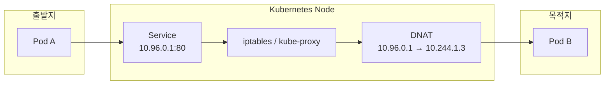
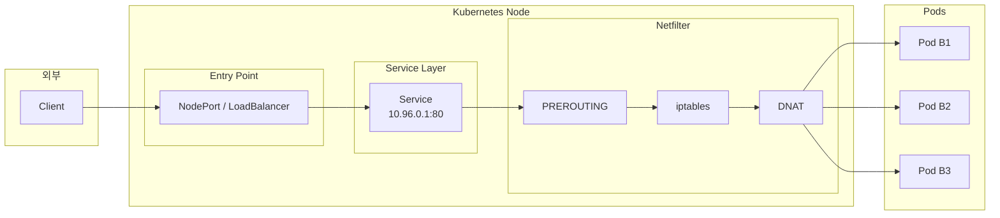

# 📚 내용 정리

## 쿠버네티스 네트워크

Kubernetes는 Pod 간 직접통신이 가능하도록 설계되어 있다.

```bash
Pod → TCP/IP Stack → CNI → Network → Pod
```

Pod는 각각 고유한 IP를 가지며, TCP/IP 스택을 통해 통신한다. Pod도 리눅스 프로세스라서 TCP/IP stack을 그대로 사용한다. Pod는 보통 eth0 인터페이스를 가지고 있다. 이 인터페이스는 veth(virtual ethernet)으로 namespace안에서 `eth0  ←→  veth pair  ←→  host namespace (cni0 or bridge)`로 이동한다.

CNI는 패킷이 파드 밖으로 나가도록 길을 만들어준다. CNI는 Pod의 가상 인터페이스와 노드의 네트워크를 연결하는 `veth pair`를 관리한다. 쿠버네티스 환경은 파드가 수시로 생성되고 사라지기 때문에 매번 수동으로 IP를 할당하고 경로를 지정하기 어려우니까 이런 작업을 CNI가 해준다.

쿠버네티스는 네트워크 구현을 하지 않는다. 대신에 CNI(Container Network Interface)를 지원하는데, 다양한 네트워크 환경(클라우드 환경, 온프레미스, 속도가중요한곳, 보안이 중요한 곳 등등..)이 존재하기 때문에 내 환경에 맞게 CNI를 골라서 선택하면 된다.

이러한 CNI에는 **Cilium, Calico, Flannel** 같은 네트워크 전문 솔루션들이 있다. CNI는 Pod에 ip를 부여하고 어디로 보내야하는지 라우팅을 설정한다.

Network부분에서 실제로 패킷이 이동한다. 같은 노드의 경우 bridge를 통해 빠르게 이동하지만, 다른 노드로 이동하는 경우 CNI별로 이동에 차이가 있다. 
```bash
# 리눅스 커널 레벨에서 패킷이 처리되는 흐름 (데이터가 네트워크로 나가는 과정)
Application → Socket → TCP → IP → netfilter(conntrack) → NIC

Application으로 데이터 요청이 들어옴
socket이 해당 요청을 커널로 넘김. 데이터가 소켓 버퍼 들어감.
데이터를 TCP segment로 변환해서 연결을 준비함
목적지 IP를 추가하고, 라우팅을 결정한다.
netfilter에서 연결을 conntrack 테이블에 저장하고, iptables룰 주소 변경작업
NIC에서는 패킷을 전기신호로 바꿔서 네트워크로 전송한다.

# 쿠버네티스에서의 흐름
Pod(App) → Socket → TCP/IP → netfilter (iptables + conntrack) → CNI (veth/bridge)
→ Node NIC → Network → (다른 Node → Pod)

Pod도 리눅스 기반이기때문에 동일함
만약에 service를 사용한다면 nefilter에서 Cluster IP를 Pod ip로 변경 (DNAT)
CNI로 네트워크 연결(파드와 노드를 연결)
NIC에서 다른 노드로 이동하거나 실제 네트워크 이동작업이 수행
```

### TCP/IP stack
패킷을 만들고, 어디로 보낼지 결정하는 기본 엔진


### netfilter
커널에서 패킷을 특정 지점에서 가로채는 hook 시스템

- 역할
    1. 패킷 필터링(방화벽)
    2. NAT(주소 변환)
    3. 트래픽 제어

패킷은 커널 내부에서 이동하면서 정해진 체인(chain)을 순서대로 통화한다.

- 체인종류
    - PREROUTING → 들어오자마자
    - INPUT → 내 컴퓨터로 들어올 때
    - FORWARD → 다른 곳으로 전달할 때
    - OUTPUT → 내 컴퓨터에서 나갈 때
    - POSTROUTING → 나가기 직전

쿠버네티스는 Service를 통해 가상IP(실제로는 존재하지 않음)를 제공한다. 따라서 Service IP로 들어온 패킷을 실제 Pod IP로 변환하는 작업이 필요한데 **netfilter**가 그 역할을 한다.

```bash
Pod → Service IP
      ↓
netfilter (PREROUTING / OUTPUT)
      ↓
DNAT (Service → Pod IP)
      ↓
실제 Pod로 전달
```

### iptables (룰 설정도구)

netfilter에서 어떤 처리를 할지 정의하는 롤 관리 도구

ex) 어떤 패킷을 허용할지 ACCEPT (허용) / 어떤 패킷을 버릴지 DROP (차단) / 어떤 패킷의 주소를 바꿀지 DNAT (목적지 변경), SNAT (출발지 변경)

### conntrack (상태추적)

netfilter에 포함된 기능으로, 네트워크 연결의 상태를 추적하고 기록하는 테이블

예) Service IP를 Pod IP로 변환하는 DNAT가 수행되면 conntrack에  원본 ip&포트, 변환 IP&포트 등이 기록된다. 이 기록을 보고 일관성있게 역방향을 수행한다.

## 쿠버네티스 네트워크 흐름 3가지 경우

### 1. Pod-to-Pod

- 모든 파드는 고유 IP를 가짐
- Pod는 서로 직접 통신이 가능해야한다.
- 클러스터 내부에서는 NAT 없이 라우팅으로 직접 통신
    - CNI가 파드에 IP를 할당하고 노드와 파드사이에 veth pair로 연결했기 때문에 IP라우팅으로 바로 통신이 가능하다.

a. 싱글노드 Pod 네트워크
        

        
cni0는 리눅스 브리지 역할로 Pod들의 veth를 한곳으로 모아주는 가상 스위치이다. 따라서 내부의 브리지와 라우팅만으로 통신이 가능하다.
        
b. 멀티노드 Pod 네트워크
        


마찬가지로 Pod에서 Node쪽 veth로 연결. Node에서 라우팅 테이블을 보고 IP를 찾음. 
(그림에 있는 NAT는 외부 통신용 SNAT)

해당 사례는 캡슐화(Flannel)방식으로 노드 IP기준으로 패킷을 전달하는 과정
        
### 2. Pod-to-Service
    
Pod는 언제든지 재시작되어 IP주소가 변경된다. 따라서 이 IP를 고정하는 Serivce 계층을 사용할 수 있다.

- Service를 통해 여러 파드에 부하를 분산하며 통신
- kube-proxy + iptables가 핵심
- iptables 규칙은 ServiceIP를 보는 순간 실제 Pod IP로 DNAT해준다.
- conntrack이 이 연결을 기억해서 응답패킷도 역방향으로 변환해줌



    
| 구분 | 역할 | 내용 |
| --- | --- | --- |
| CNI (Calico) | 네트워크 연결 | Pod에 IP 할당,<br> Pod ↔ Pod 라우팅 구성,<br> 노드 ↔ Pod 네트워크 연결 |
| kube-proxy | Service 처리 | iptables 규칙 생성, <br> Service IP → Pod IP 매핑 |

### 3. External-to-Service

Pod는 사설 네트워크 IP를 사용하기 때문에 외부에서 직접 접근이 불가능하다. 따라서 내부로 들어오기 위한 진입 지점이 필요하다. 
ex. NodePort, LoadBalancer, Ingress

- NAT이 발생한다. (외부 → 내부 DNAT / 내부 → 외부 SNAT)
    

    


# 🤔 궁금한 점

**1. 쿠버네티스에서 NAT은 어디서 쓰이는지?**

 NAT: 네트워크 주소 변환 기술
 / 주로 내부 네트워크에서 사용하는 사설 IP를 공인 IP로 바꿀 때 사용

- 쿠버네티스에서의 NAT
1. egress (Pod -> 외부)
    SNAT: Pod IP를 Node IP로 변경
3. ingress (외부/service -> Pod)
    DNAT: 외부 사용자가 kube-proxy를 통해 Pod ip로 변환되어 들어옴

kube-proxy: iptables 규칙으로 NAT 수행

**2. Socket은 어떻게 동작하는가?**

리눅스 커널 레벨에서 패킷이 처리되는 실제 실행 흐름


소켓은 유저공간(애플리케이션)과 커널 네트워크 스택을 연결하는 구조이다.
- 애플리케이션의 데이터를 전달받음
- 데이터를 커널의 소켓 버퍼에 저장
- TCP/IP 스택으로 넘겨줌

- 소켓의 흐름
```
[ Application ]
       ↓ (socket)
[ TCP / IP / netfilter ]
       ↓
[ NIC ]
```
- 네트워크 시작이 되는 API 흐름
```
socket() → bind() → connect() / accept()

socket: 네트워크 통신에 사용할 소켓 객체를 커널에 만든다.
bind: 이 소켓이 사용할 IP와 Port를 지정한다.
connect: 클라이언트가 서버로 요청을 보냄
accept: 서버가 요청을 받아서 새 소켓을 만듦

소켓은 하나의 연결당 하나씩 생성됨
```
- Pod안 애플리케이션도 socket()으로 통신을 시작함.
- conntrack는 socket 연결정보를 기억해서 응답이 원래 요청과 맞게 돌아오게 한다.

 ---

출처) [https://medium.com/finda-tech/kubernetes-네트워크-정리-fccd4fd0ae6](https://medium.com/finda-tech/kubernetes-%EB%84%A4%ED%8A%B8%EC%9B%8C%ED%81%AC-%EC%A0%95%EB%A6%AC-fccd4fd0ae6)


