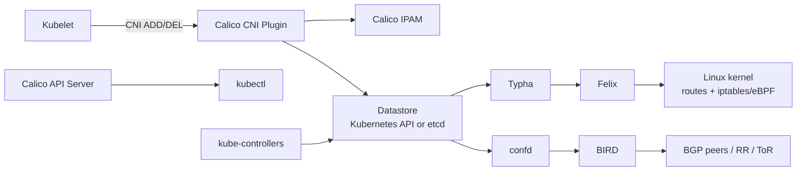

## 01. Calico Architecture
- Calico 네트워크에서는 각 노드가 해당 노드에 존재하는 모든 엔드포인트들에 대한 라우터 역할을 한다. 즉, vRouter 역할을 한다.
	- 일반적으로 라우터는 데이터 플레인(패스) + 컨트롤 플레인 + 관리 플레인으로 구성돼있다.
	- Calico 아키텍처의 vRouter에서는 각 구성요소는 다음과 같이 대응된다.
		- 데이터 플레인(패스) : Linux Kernel - iptables
			- 패킷 포워딩 실질적 수행
		- 컨트롤 플레인 : BGP 데몬
			- 라우팅·신호 등 제어 및 경로 결정 담당
		- 관리 플레인 : `calico-felix`
			- 설정, 모니터링, 트래픽 담당
			- k8s 클러스터에서 etcd를 통해 클러스터 상태를 확인하고 iptables·routes 등의 설정을 내려준다.



## 02. Calico Component
### 02.01. Calico API server
- `kubectl` 을 사용해서, Calico 리소스를 직접 관리 가능하다.

### 02.02. Calico Node
- 쿠버네티스 클러스터에서 데몬셋 형태로 배포된다.
- `calico/node` 컨테이너는 내부적으로 Felix, BIRD, confd를 실행한다.

#### 02.02.01. Felix
- Calico 의 핵심 host agent이다.
- vRouter에서 관리 플레인을 담당한다
- 해당 노드에 존재하는 엔드포인트의 연결을 맺기 위해 필요한 경로, ACL 등 기타 모든 설정을 담당한다. 해당 노드/호스트 서버에서 에이전트 데몬 형태로 실행된다.
	- host에 필요한 **route**를 프로그래밍한다.
	- Linux kernel에 **ACL/정책**을 프로그래밍한다.
	- interface 정보를 관리한다.
	- 상태를 datastore에 보고한다.
- `calico-node` 데몬셋 파드 안에서 프로세스로 실행된다.
- `calico-node`안에 ps 명령이 없어서, 노드에서 확인.
```bash
root        5493  0.0  0.1 1238384 16016 ?       Sl   Mar30   7:39 /usr/bin/containerd-shim-runc-v2 -namespace k8s.io -id b248bd618daded9985431cca3a1e974be69fbc460a2b1a3618543e6e75cd15f7 -address /run/containerd/containerd.sock
65535       5515  0.0  0.0    996     4 ?        Ss   Mar30   0:00  \_ /pause
root        5818  0.0  0.0   4412   836 ?        Ss   Mar30   0:03  \_ /usr/local/bin/runsvdir -P /etc/service/enabled
root        5889  0.0  0.0   4260   840 ?        Ss   Mar30   0:00  |   \_ runsv cni
root        5897  0.0  0.7 1791712 58908 ?       Sl   Mar30   0:18  |   |   \_ calico-node -monitor-token
root        5890  0.0  0.0   4260   844 ?        Ss   Mar30   0:00  |   \_ runsv felix
root        5917  0.5  0.9 2309116 73860 ?       Sl   Mar30  48:47  |   |   \_ calico-node -felix
```

#### 02.02.02. BIRD
- Felix로부터 routes 정보를 가져와 이를 네트워크 상 BGP peer에 배포한다.

#### 02.02.03. confd
- confd는 etcd와 같은 데이터베이스의 변경을 모니터링하고, BIRD 설정 파일을 생성/갱신한다.
- 변경 시 BIRD가 새 설정을 로드하도록 연결한다. 즉, BGP 설정 반영 자동화를 수행한다.


---

# References
- https://docs.tigera.io/calico/latest/reference/architecture/overview
- https://docs.tigera.io/calico/latest/reference/architecture/design/l3-interconnect-fabric
- https://coffeewhale.com/calico-mode
- 