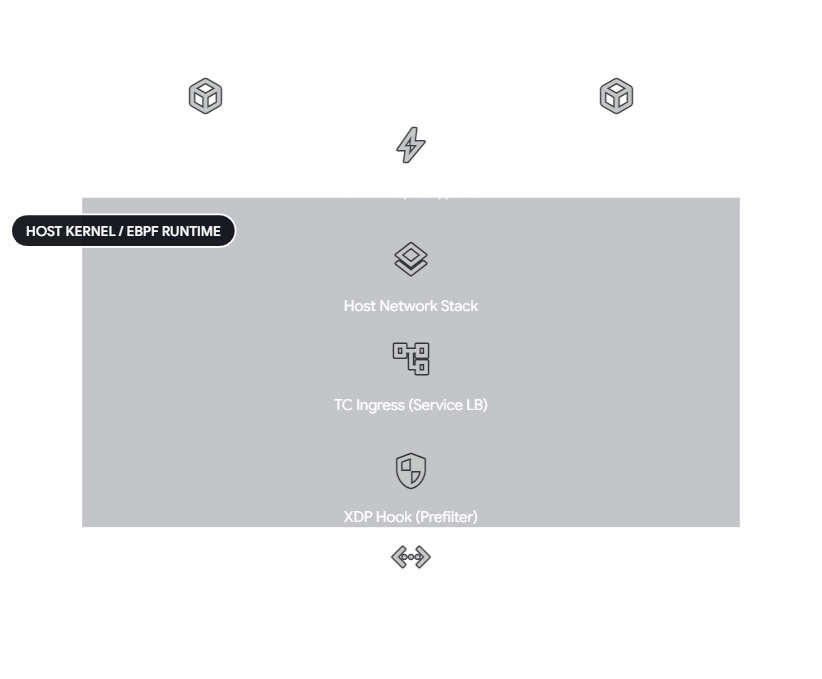
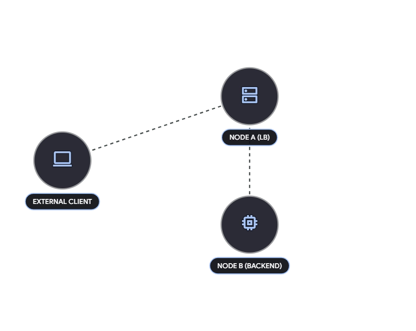

# Cilium 주요 컴포넌트

### ① Agent (`cilium-agent`)

- **위치:** 데몬셋(DaemonSet) 형태로 클러스터의 모든 노드에서 각각 실행됩니다.
- **역할:** 각 노드의 네트워크 제어를 전담하는 핵심 프로세스입니다.
- **동작 방식:** 쿠버네티스 API 서버와 통신하여 네트워크 정책, 서비스 로드밸런싱, 가시성 설정 등을 수신합니다. 파드(Pod)의 시작 및 종료 이벤트를 감지하고, 이에 맞춰 리눅스 커널의 eBPF 프로그램(XDP, tc 등)을 컴파일하고 로드하여 실제 네트워크 패킷 제어 규칙을 커널에 적용합니다.

### ② Operator (`cilium-operator`)

- **위치:** 클러스터 레벨에서 디플로이먼트(Deployment) 형태로 실행됩니다. (일반적으로 리더 선출을 통해 단일 인스턴스만 활성화)
- **역할:** 개별 노드가 아닌, 클러스터 전체에서 단 한 번만 수행되어야 하는 논리적 전역 관리(Global Management) 작업을 담당합니다.
- **동작 방식:** 데이터패스(실제 패킷이 지나가는 경로)에는 전혀 관여하지 않습니다. 주요 작업은 노드별 IP 주소 대역(IPAM) 할당과 KV Store의 헬스체크(Heartbeat) 관리입니다. 따라서 오퍼레이터가 일시적으로 다운되더라도 기존 네트워크 통신은 유지되지만, 새로운 IP가 필요한 신규 파드 스케줄링은 지연됩니다.

### ③ CNI Plugin (`cilium-cni`)

- **위치:** 각 노드의 CNI 바이너리 디렉토리에 설치됩니다.
- **역할:** 쿠버네티스 컨테이너 런타임(Kubelet)과 Cilium 네트워크 로직을 연결하는 표준 인터페이스입니다.
- **동작 방식:** 파드가 노드에 스케줄링되거나 삭제될 때 Kubelet에 의해 실행됩니다. `cilium-cni` 자체는 복잡한 네트워크 로직을 가지지 않으며, 동일 노드에 떠 있는 `cilium-agent`의 API를 호출하여 해당 파드에 대한 IP 할당, 네트워크 인터페이스 생성, eBPF 기반의 데이터패스 설정 작업을 트리거(Trigger)합니다.

### ④ Hubble (가시성 컴포넌트 모음)

Hubble은 eBPF 기반의 네트워크 관측성(Observability)을 제공하는 시스템으로 서버와 릴레이로 나뉩니다.

- **Hubble Server:** 고성능과 낮은 오버헤드를 위해 별도 프로세스가 아닌 **`cilium-agent` 내부에 통합(Embedded)**되어 실행됩니다. eBPF가 커널에서 수집한 네트워크 흐름(Flow) 데이터를 가져와 gRPC API 및 Prometheus 메트릭으로 노출합니다.
- **Hubble Relay (`hubble-relay`):** 클러스터 전체를 조망하는 독립된 컴포넌트입니다. 모든 노드의 Hubble Server gRPC API에 연결하여 데이터를 취합한 뒤, 단일 엔드포인트를 통해 클러스터 전체의 네트워크 연결 및 종속성 상태를 클라이언트(CLI/UI)에 제공합니다.

### ⑤ Data Store (데이터 저장소)

- **역할:** 클러스터 내 여러 `cilium-agent` 간에 상태 정보(예: 보안 식별자, 엔드포인트 IP 매핑 정보 등)를 전파하고 동기화하는 백엔드 저장소입니다.
- **옵션:**
    - **Kubernetes CRD (기본값):** 쿠버네티스 API 서버를 데이터 스토어로 사용하여 별도의 관리 포인트 없이 운영이 가능합니다.
    - **KV Store (etcd 등):** 대규모 클러스터 환경에서 상태 변경 알림과 데이터 처리 효율을 높이기 위한 최적화 옵션입니다. K8s API 서버의 부하를 줄이기 위해 별도의 etcd 클러스터를 사용합니다.

---

### Pod 생성 시나리오

1. **IP 대역 확보 (Operator -> Data Store):** `cilium-operator`는 클러스터 전체의 IPAM을 관리하며, 사전에 각 노드에 사용할 IP 대역(CIDR)을 할당하여 Data Store(CRD)에 기록합니다.
2. **파드 스케줄링 및 트리거 (Kubelet -> CNI):** Kubelet이 특정 노드에 파드를 스케줄링한 뒤, 네트워크 구성을 위해 `cilium-cni`를 호출합니다.
3. **네트워크 설정 위임 (CNI -> Agent):** 호출된 `cilium-cni`는 직접 작업하지 않고 해당 노드의 `cilium-agent`에게 REST API를 통해 파드의 네트워크 설정을 요청합니다.
4. **IP 할당 및 eBPF 로드 (Agent -> eBPF / Data Store):** `cilium-agent`는 노드에 할당된 IP 대역에서 파드에 IP를 부여하고 veth 인터페이스를 생성합니다. 동시에 K8s API로부터 파드에 적용될 네트워크 정책을 확인한 후, 이 규칙을 eBPF 바이트코드로 커널의 Hook(XDP, tc 등)에 로드합니다. 변경된 파드 IP와 보안 식별자는 Data Store에 업데이트되어 다른 노드의 Agent들에게 전파됩니다.
5. **데이터패스 통신 시작 (eBPF):** 파드가 외부로 패킷을 전송하면 커널 스택의 iptables나 라우팅 테이블을 거치기 전/후에 eBPF 프로그램이 개입하여 최적의 경로로 포워딩하거나 정책에 따라 차단합니다.
6. **메타데이터 수집 및 취합 (Agent/Hubble Server -> Hubble Relay):** 실시간 패킷 처리 과정에서 eBPF가 생성한 흐름 데이터는 `cilium-agent` 내의 Hubble Server로 전달됩니다. 관리자가 상태를 조회하면 `hubble-relay`가 각 노드의 Hubble Server 데이터를 취합하여 시각화된 데이터로 반환합니다.

# Hook

Hook은 이벤트나 처리 지점에서 외부 코드를 끼워 넣어 실행할 수 있는 연결점이다.

eBPF는 이벤트 기반으로 동작하고, 커널이나 어플리케이션이 특정 hook point를 지날 때에 프로그램이 실행된다.

## XDP

네트워크 드라이버에서 가장 앞서있는 지점에 붙어있다. 패킷 수신 직후 실행된다.

그래서 성능이 가장 좋고, 악성 트래픽 drop, prefilters, DDoS 완화 등에 적합하다.

## tc (ingress/egress)

초기 네트워크 스택 처리가 끝난 뒤, L3(라우팅) 전에 실행된다. 이 시점은 XDP보다 느리지만, 패킷 메타데이터를 더 많이 확인할 수 있다. 따라서 로컬 노드 처리, L3/L4 endpoint policy, redirect, 서비스 lookup 같은 일을 하기 적합하다.

특히 컨테이너는 보통 veth pair를 쓰기 때문에, host 쪽 tc ingress에 붙이면 컨테이너를 드나드는 모든 트래픽을 통제할 수 있다.

## socket operations

루트 cgroup에 부착되어 TCP 상태 변화를 감시한다. 특히 연결이 `ESTABLISHED` 상태가 될 때 로컬 노드 내의 통신인지 확인한다.

## socket send/recv

TCP 소켓의 `send` 작업마다 실행된다. 메세지를 검사하고 TCP 계층으로 내리지 않고 목적지 소켓으로 직접 리다이렉트하여 처리를 가속화한다.

# Networking Objects

## Prefilter

XDP 훅에서 실행되며, 유효하지 않은 목적지 등을 가진 패킷을 스택 처리 전에 최고 속도로 폐기합니다.

## Endpoint Policy

파드(Endpoint)의 보안 정책(L3/L4)을 실행한다.

맵(Map)을 조회하여 패킷을 허용/차단하거나, L7 정책 처리를 위해 Envoy 프록시로 넘깁니다.

## Service

tc Ingress 훅을 사용하여 목적지 IP/Port를 기반으로 로드밸런싱(Service IP -> Pod IP 변환)을 수행합니다.

## L3 Encryption

IPsec 등을 활용하여 패킷을 투명하게 암호화(Egress) 및 복호화(Ingress)합니다.

## Socket Layer Enforcement

Socket 훅을 활용하여 로컬 파드 간 통신이나 프록시 통신 시, 하위 네트워크 스택(TCP/IP)을 우회하고 소켓 간 직접 통신을 만들어 지연 시간을 최소화합니다.

## L7 Policy

HTTP, gRPC 등 애플리케이션 계층의 세밀한 접근 제어를 위해 패킷을 유저 스페이스의 Envoy 프록시로 전달하여 처리합니다.

## 시나리오 3가지

### 1) 외부 악성 트래픽 (DDoS 방어)

외부에서 노드(서버)를 공격하기 위해 대량의 비정상 패킷이 쏟아져 들어올 때, Cilium이 **XDP(eXpress Data Path) 훅**을 통해 보호한다.

1. **NIC 수신:** 물리적 네트워크 인터페이스 카드(NIC)가 외부 패킷을 수신합니다.
2. **XDP 훅 개입:** 리눅스 커널이 이 패킷을 처리하기 위해 메모리(`sk_buff` 구조체)를 할당하기도 전에, 네트워크 드라이버 계층에 붙어 있는 XDP 훅이 가장 먼저 실행됩니다.
3. **Prefilter 객체 검사:** XDP 훅에 로드된 eBPF 프로그램(Prefilter)이 패킷의 헤더(출발지 IP 등)를 읽고, 사전에 정의된 차단 목록(BPF Map)과 대조합니다.
4. **즉각 폐기 (Drop):** 악성 트래픽으로 판별되면 커널 스택으로 올려보내지 않고 그 즉시 네트워크 카드 레벨에서 패킷을 폐기(`XDP_DROP`)합니다. CPU와 메모리 낭비를 원천 차단합니다.

### 2) 외부 정상 트래픽

외부 사용자가 쿠버네티스의 '서비스(Service)' IP로 접근하여 내부의 정상적인 파드(Pod)로 연결되는 과정. 여기서는 tc Ingress 훅이 핵심 역할을 한다!

1. **NIC 및 XDP 통과:** 정상 패킷이므로 NIC로 들어온 뒤 XDP 훅의 필터링을 무사히 통과합니다.
2. **커널 메모리 적재:** 커널이 패킷을 정상적으로 메모리에 적재하여 네트워크 스택 처리를 시작합니다.
3. **tc Ingress 훅 개입 (Service 변환):** 패킷이 L3 라우팅을 타기 직전, tc Ingress 훅이 실행됩니다. Cilium의 Service 객체가 패킷의 목적지 주소(가상의 Service IP)를 확인하고, 이를 실제 통신을 담당할 파드의 IP(Endpoint IP)로 변환(DNAT)합니다.
4. **Endpoint Policy 검사:** 동시에 Endpoint Policy 객체가 해당 트래픽이 파드로 들어갈 권한이 있는지 L3/L4 네트워크 정책(NetworkPolicy)을 검사합니다.
5. **veth를 통한 전달:** 정책이 허용되면, 패킷은 복잡한 iptables 룰체인을 거치지 않고 해당 파드와 연결된 가상 인터페이스(`veth pair`)를 통해 타겟 파드 내부로 곧바로 전달됩니다.

### 3) 동일 노드 내 Pod 간 TCP 통신 (Socket Bypass)

같은 노드 안에 있는 Pod A에서 Pod B로 통신할 때

- Socket Bypass가 없다면?
    1. Pod A의 애플리케이션이 데이터를 소켓으로 보냅니다.
    2. 데이터가 Pod A의 가상 TCP/IP 스택을 타고 맨 아래 L2 계층까지 내려옵니다.
    3. `veth` 파이프를 타고 호스트(노드)의 네트워크 스택으로 빠져나옵니다.
    4. 호스트 커널에서 다시 목적지를 확인하고 라우팅/iptables 검사를 거칩니다.
    5. 호스트 스택을 타고 다시 올라와 Pod B와 연결된 `veth` 파이프를 탐색합니다.
    6. Pod B의 하위 네트워크 계층을 타고 올라가 마침내 Pod B의 소켓 버퍼에 도달합니다.
- Cilium Socket Bypass

  Cilium은 eBPF를 통해 운영체제의 소켓 계층 자체 (Socket operations 훅)을 감시하고 있다. 따라서 위와 같은 불필요한 상승 하강을 완전히 없앤다.

    1. **연결 상태 감지:** Pod A와 Pod B가 처음 연결(`ESTABLISHED`)을 맺을 때, 커널 cgroup에 붙어 있는 Socket Operations 훅이 "이 두 소켓은 같은 노드 안에 있다"는 것을 파악하고 BPF Map에 기록합니다.
    2. **데이터 송신 가로채기:** Pod A가 `send()` 함수를 호출하여 메시지를 보내는 바로 그 순간, **Socket Send/Recv 훅**이 이 메시지를 TCP/IP 스택으로 내려가기 전에 가로챕니다.
    3. **직접 복사 (Bypass):** 가로챈 메시지의 페이로드를 Pod A의 송신 소켓 버퍼에서 Pod B의 수신 소켓 버퍼로 직접 복사(Redirect)합니다.
    4. 커널 하위 네트워크 스택(라우팅, 방화벽, 인터페이스 드라이버 등)은 이 트래픽이 발생했다는 사실조차 알 필요 없이 처리가 완료됩니다. 이로 인해 지연 시간(Latency)이 극단적으로 단축됩니다.

# Kube-proxy 완전 대체

기존 쿠버네티스 환경에서는 서비스 라우팅을 통하여 kube-proxy가 수많은 iptables 규칙을 생성하며 관리했다. Cilium은 kube-proxy를 클러스터에서 완전히 제거하고, eBPF를 이용하여 트래픽 처리 성능을 극대화한다.

- 소켓 계층 : 파드나 호스트에서 발생하는 내부 트래픽이 커널의 네트워크 스택을 타지 않고, 소켓 계층에서 목적지 백엔드(Pod)의 IP로 즉시 변환
- XDP : NodePort나 LoadBalancer로 들어오는 외부 트래픽을 리눅스 커널 스택 위로 올리지 않고, 네트워크 카드(NIC) 드라이버 계층인 XDP에서 직접 BPF 프로그램이 처리

## 주요 고급 로드밸런싱 설정

### SNAT / DSR

- **SNAT 모드 (기본값):** 트래픽을 받은 노드가 목적지 파드가 있는 다른 노드로 패킷을 넘길 때, 자신의 IP로 출발지 주소를 변환(SNAT)합니다. 백엔드 파드는 요청을 처리한 후 다시 중간 노드로 응답을 보내고, 중간 노드가 클라이언트에게 최종 응답합니다. (추가 홉 발생)
- **DSR 모드:** 트래픽을 받은 노드가 패킷을 백엔드 노드로 넘길 때 클라이언트의 원본 Source IP를 그대로 보존합니다. 백엔드 파드는 처리가 끝나면 중간 노드를 거치지 않고 **클라이언트에게 직접 응답**합니다. 네트워크 대역폭 병목을 줄이고 지연 시간을 낮추는 데 탁월합니다.
    - *DSR with Geneve:* DSR 적용 시 IP 옵션 헤더가 클라우드 라우터에서 드롭되는 문제를 막기 위해 Geneve 터널링으로 감싸서 전달하는 방식입니다.

### Maglev Consistent Hashing

- **Client Source IP 보존:** `externalTrafficPolicy=Local`을 설정하면, 외부 트래픽이 무조건 파드가 떠 있는 해당 노드로만 전달되도록 강제하여 불필요한 노드 간 횡단(East-West)을 막고 Source IP를 보존합니다.
- **내부 트래픽 통제:** `internalTrafficPolicy=Local`을 사용하면 클러스터 내부 통신 시에도 동일 노드 안에 있는 파드에게만 트래픽을 보내도록 강제할 수 있습니다.

### Traffic Policy

- **Client Source IP 보존:** `externalTrafficPolicy=Local`을 설정하면, 외부 트래픽이 무조건 파드가 떠 있는 해당 노드로만 전달되도록 강제하여 불필요한 노드 간 횡단(East-West)을 막고 Source IP를 보존합니다.
- **내부 트래픽 통제:** `internalTrafficPolicy=Local`을 사용하면 클러스터 내부 통신 시에도 동일 노드 안에 있는 파드에게만 트래픽을 보내도록 강제할 수 있습니다.

## 그럼에도 불구하고 kube-proxy를 써야하는 상황이 있나?

- eBPF의 고급 기능 (ex. socket 계층 소통, XDP 통한 외부 트래픽 소통) 은 비교적 최신 리눅스 커널 (최소 4.19, 권장 5.4 이상)에서야 제대로 동작한다. 기업 현장에서는 CentOS 7(커널 3.10) 같은 비교적 옛 운영체제를 사용하는 경우가 많다.
- 일반적인 웹 서비스(TCP/UDP)가 아닌, 통신사(5G 망) 등에서 주로 사용하는 SCTP…? 프로토콜의 경우 Cilium의 eBPF에서 지원이 매우 제한적이다. 완벽한 SCTP 라우팅 및 로드밸런싱이 필요한 클러스터라면 IPVS 모드로 설정된 kube-proxy가 필수적이다.
- eBPF의 소켓 로드밸런서가 켜진 상태에서, 파드가 외부가 아닌 클러스터 내부의 Servie IP를 목적지로 삼아 NFS 같은 볼륨을 마운트하려하면 커널 충돌로 인해 깨지는 현상이 발생하는 버그가 있다고 한다.. 특정 최신 커널 패치가 적용되지 않은 상태에서 이러한 네트워크 스토리지 아키텍처를 강하게 의존하고 있다면 eBPF 사용을 지양하는 것이..
- 보안을 극대화하기 위해 일반적인 containerD나 Docker 대신 Kata Containers, gVisitor와 같은 가상머신 기반의 샌드박스 런타임을 사용하는 경우. 이들은 호스트와 파드의 네트워크 네임스페이스가 엄격하게 분리되어 있어서, 커널 소켓을 훔쳐보는 eBPF의 소켓 로드밸런서가 무력화된다. 최근에는 이를 우회하는 옵션(`socketLB.hostNamespaceOnly=true`)이 생겼지만, 아키텍처의 복잡도를 낮추기 위해 그냥 호환성이 확실한 kube-proxy를 선택하는 것이 낫다고 하는 경우가 있다.

⇒ 성능이 클러스터 운영의 1순위 목표라면 Cilium이 좋지만, 구형 커널 호환성, 특수 프로토콜, 안정적인 네트워크 스토리지 연결 등이 더 중요하다면 kube-proxy

---

# 참고 공식 문서

Cilium Component Overview: https://docs.cilium.io/en/stable/overview/component-overview/

Cilium eBPF Datapath Introduction: https://docs.cilium.io/en/stable/network/ebpf/lifeofapacket/

Cilium Life of a Packet: https://docs.cilium.io/en/stable/network/ebpf/lifeofapacket/

Kubernetes Without kube-proxy:

https://docs.cilium.io/en/stable/network/kubernetes/kubeproxy-free/