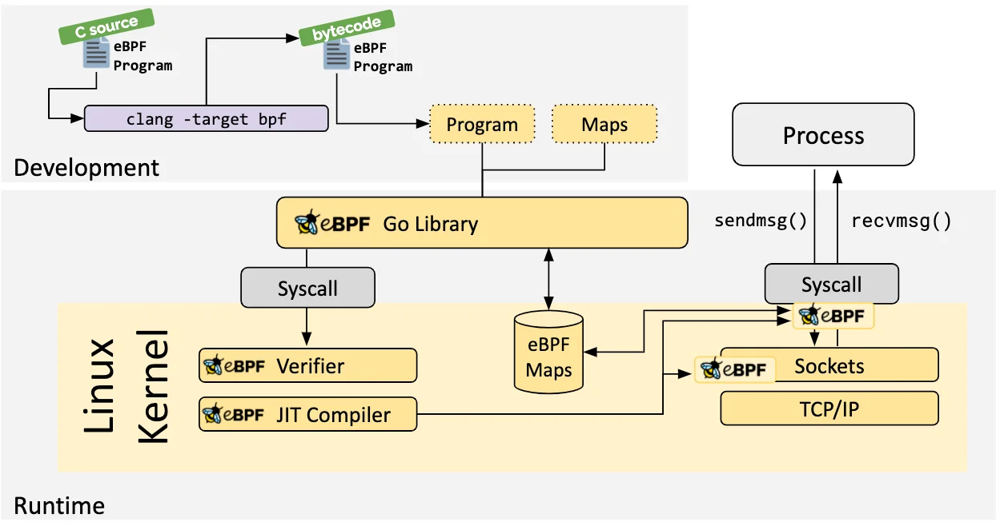
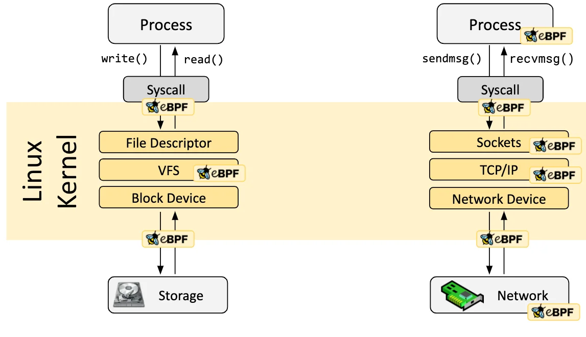
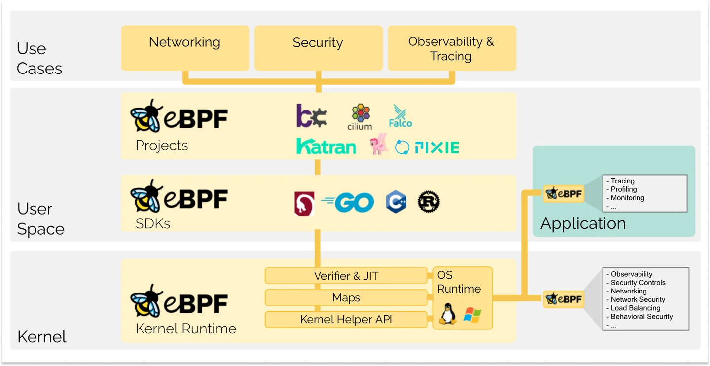

# Week 4 - eBPF와 Cilium

## 0장. eBPF의 등장 배경: 패킷 필터에서 커널의 혁명으로

### 핵심 한 줄
**eBPF는 "패킷 필터"를 "커널 내부의 범용 실행 플랫폼"으로 확장한 기술이다.**

초기 cBPF는 네트워크 분석에서 필요한 최소 기능에 집중했습니다. 커널에서 유저 공간으로 모든 패킷을 복사하지 않고, 커널 안에서 먼저 필터링해 병목을 줄이는 방식이었습니다. 당시에는 충분히 실용적이었지만, 컨테이너 오케스트레이션과 대규모 클러스터 운영이 일반화된 환경에서는 한계가 분명해졌습니다.

여기서 중요한 건 "기술이 좋아져서"가 아니라 "운영 문제가 바뀌어서" eBPF가 필요해졌다는 점입니다. 단일 서버 중심 시기에는 정적 규칙과 단순 필터링으로도 버틸 수 있었지만, 마이크로서비스와 멀티테넌트 환경에서는 서비스 생성/삭제, IP 변동, 정책 변경이 매우 자주 발생합니다. 이때 기존 방식은 규칙 체인이 길어지고, 동기화 비용이 커지고, 문제 원인 추적이 어려워지는 방향으로 무거워졌습니다.

### 1. Classic Berkeley Packet Filter(cBPF)의 탄생 (1992년)

1992년 Steven McCanne, Van Jacobson의 논문에서 출발한 문제의식은 명확했습니다. "모든 패킷을 유저 공간으로 복사해 분석하면 너무 느리다"는 것이었습니다. 그래서 커널 안에서 먼저 패킷을 선별하는 작은 가상 머신(Virtual Machine, VM) 모델이 제안됐고, 이것이 cBPF의 시작점이 됩니다.

- 핵심 아이디어: 유저 공간으로 올리기 전에 커널에서 먼저 필터링
- 구조적 특징: 레지스터 2개 중심의 매우 단순한 실행 모델
- 대표 활용: tcpdump, wireshark의 패킷 필터 기반

즉 cBPF는 "범용 커널 프로그래밍"이 아니라, "빠른 패킷 필터링"이라는 단일 목적에 매우 충실한 기술이었습니다.

### 2. cBPF의 한계와 요구사항 변화

시간이 지나며 리눅스 환경은 크게 바뀌었습니다.

- 성능 압력 증가: 10G/40G급 네트워크에서 단순 필터 구조만으로는 병목 완화가 어려워짐
- 확장성 요구 증가: 패킷뿐 아니라 syscall, 함수 호출, 스케줄링 이벤트까지 동적으로 관측/제어하려는 수요가 급증

결국 "패킷만 고르면 된다"는 시대에서 "커널 전반을 안전하게 프로그래밍하고 싶다"는 시대로 넘어갔습니다.

### 3. eBPF의 등장 (2014년)

Alexei Starovoitov 등을 중심으로 발전한 eBPF(extended Berkeley Packet Filter)는 이름은 BPF를 이어받았지만, 실제 성격은 거의 새 플랫폼에 가깝습니다.

- 레지스터 확장: 2개 수준에서 10개 64-bit 레지스터 모델로 확장
- 상태 공유: eBPF map을 통해 커널/유저 공간 간 데이터 공유 가능
- 범용 hook: kprobe, tracepoint, eXpress Data Path(XDP), Traffic Control(TC) 등 다양한 지점에 코드 부착 가능
- 실행 성능: Just-In-Time(JIT) 컴파일로 바이트코드를 기계어로 변환해 고성능 확보

이 변화로 BPF는 "필터"를 넘어 "검증 가능한 커널 내 동적 실행"이라는 성격을 갖게 됩니다.

### 4. 왜 Cilium은 eBPF를 선택했나 (Turning Point)

Kubernetes 네트워킹이 iptables 의존도가 높았던 시기에, 규칙 수 증가에 따른 성능 저하와 운영 복잡도가 병목으로 드러났습니다.

- Programmability: 커널 재컴파일/재부팅 없이 네트워크 로직 반영 가능
- Efficiency: 긴 규칙 체인 순차 대조 대신 map 기반 조회 중심으로 빠른 처리

그래서 Cilium은 eBPF를 단순 가속기가 아니라, 서비스 로드밸런싱/네트워크 정책/관측을 하나의 데이터 경로 모델로 묶는 기반으로 선택했습니다. 이 지점이 "iptables 운영"에서 "맵 기반 상태 운영"으로 넘어가는 분기점입니다.

이 타임라인을 보면 eBPF는 갑자기 등장한 새 기능이 아니라, **커널 확장 방식의 세대 교체**에 가깝습니다. 정적 규칙과 느린 반영 모델에서, 검증 가능한 동적 코드와 빠른 상태 반영 모델로 이동한 것입니다.

요구사항이 바뀌면서 관점도 바뀌었습니다. 이제는 단순히 "패킷을 고른다"가 아니라, **커널 여러 지점에서 동적으로 관측하고 제어**해야 했고, 이 문제를 받아낸 것이 eBPF입니다. 레지스터 모델, 맵 기반 상태 공유, JIT 실행 성능이 결합되면서 eBPF는 네트워크·보안·관측을 하나의 메커니즘으로 처리할 수 있는 기반이 됐습니다.

---

## 1장. eBPF 기초와 커널 삽입 메커니즘

### 핵심 한 줄
**eBPF의 안전성은 Verifier, 성능은 JIT, 확장성은 Hook 지점에서 나온다.**

개발자가 작성한 소스 코드는 LLVM/Clang을 거쳐 eBPF 바이트코드가 되고, `bpf()` 시스템 콜(`BPF_PROG_LOAD`)로 커널에 적재됩니다. 이때 프로그램이 즉시 실행되는 게 아니라 **Verifier 검증을 먼저 통과**해야 합니다. 메모리 범위, 제어 흐름, 위험한 경로를 사전에 차단해 "동적으로 로드되는 코드"를 관리 가능한 코드로 바꾸는 단계입니다.

실행 단계에서는 JIT가 바이트코드를 아키텍처별 기계어로 변환해 오버헤드를 줄입니다. 동시에 eBPF는 XDP, TC, kprobe, tracepoint처럼 서로 다른 hook 지점에 붙을 수 있어, 같은 로직이라도 목적에 따라 지연/가시성/제어 범위를 조절할 수 있습니다.

---

## 2장. Cilium 아키텍처: Go Control Plane과 eBPF Data Plane

출처: https://docs.cilium.io/en/stable/overview/component-overview/

### 먼저 보고 가기
- **Control Plane**: 정책 해석과 상태 계산
- **Data Plane**: 패킷 경로에서 정책 집행
- **핵심 연결점**: 프로그램 재생성보다 **Map 업데이트 우선**

Cilium의 구조를 한 문장으로 표현하면, **"의사결정은 유저 공간에서, 집행은 커널 공간에서"** 입니다. `cilium-agent`는 Kubernetes 이벤트를 받아 정책 상태를 계산하고, eBPF 프로그램은 계산 결과를 실제 패킷 경로에 적용합니다. 이 분리는 성능뿐 아니라 운영 안정성에도 직결됩니다.

실무적으로 중요한 부분은 변경 반영 방식입니다. Cilium은 매번 전체를 다시 만드는 대신, 영향받는 엔드포인트만 골라 regeneration하고, 가능한 경우에는 프로그램 교체 없이 맵만 갱신합니다. 그래서 정책 churn이 높은 환경에서도 반영 지연을 상대적으로 낮게 유지할 수 있습니다.

데이터 경로에서는 identity 조회, 정책 판정, 로드밸런싱(Load Balancing, LB)/네트워크 주소 변환(Network Address Translation, NAT)/연결 추적(Connection Tracking, CT) 처리 순서가 명확히 분리됩니다. 이 구조 덕분에 문제 발생 시 어느 단계에서 병목 또는 드롭이 발생했는지 추적하기가 수월합니다.

출처: https://docs.cilium.io/en/stable/network/ebpf/lifeofapacket/

여기서 꼭 강조할 지점은 lifecycle입니다. **BPF 파일 시스템(BPF filesystem, bpffs) pinning**을 활용하면 agent 재시작 시에도 기존 커널 객체(map/prog)를 재활용할 수 있어, 제어 프로세스 장애가 곧바로 데이터 경로 중단으로 이어지지 않습니다. 또한 Hubble은 단순 패킷 캡처를 넘어 **policy verdict와 identity 문맥**을 제공하므로 "왜 막혔는지"를 설명 가능한 형태로 보여줍니다.

참고 자료:
- Hubble Overview: https://docs.cilium.io/en/stable/observability/hubble/
- Hubble Command-Line Interface(CLI) Flow Inspection: https://docs.cilium.io/en/stable/observability/hubble/hubble-cli/

---

## 3장. eBPF Maps: 상태 공유와 실시간 제어의 중심

출처: https://docs.cilium.io/en/stable/reference-guides/bpf/architecture/

### 핵심 한 줄
**Cilium의 빠른 반응성은 코드 교체가 아니라 데이터 교체(Map update)에서 나온다.**

맵은 단순 자료구조가 아니라 데이터 경로의 상태 저장소입니다. 프로그램 로직은 비교적 고정한 채, 정책/백엔드/아이덴티티 같은 가변 상태를 맵에 반영해 동작을 바꿉니다. 그래서 정책 변경 시 전체 프로그램을 재배포하지 않아도 즉시 반영이 가능합니다.

맵 타입을 고를 때는 "기능 이름"보다 "접근 패턴"을 먼저 봐야 합니다. 임의 조회 중심이면 Hash/Least Recently Used(LRU) Hash, 고정 인덱스 통계면 Array/Per-CPU Array, Classless Inter-Domain Routing(CIDR) 매칭이면 LPM Trie가 맞습니다. 이벤트 전달은 Ring Buffer/Perf Event가 담당합니다.

`ct_map`은 상태 기반 방화벽의 핵심입니다. 첫 패킷에서 상태를 만들고, 후속 패킷은 CT 히트로 빠르게 통과시킵니다. 따라서 CT 축출이나 충돌이 늘면 곧바로 성능 저하로 이어집니다. `ipcache`는 IP 변동과 정책 의미를 분리해 주는 계층입니다. Pod IP가 바뀌어도 정책 판단의 기준(identity)을 유지하는 역할을 합니다.

서비스 처리에서는 service/backend/revnat 맵이 같이 움직입니다. 이 조합이 있어야 kube-proxy의 긴 체인 대신 짧은 조회 경로를 유지할 수 있습니다. 다만 맵 크기 산정이 부족하면 업데이트 실패, 재시도, 반영 지연이 누적되므로 용량 계획은 설계 단계에서 반드시 포함해야 합니다.

참고 자료:
- eBPF Maps 공식 가이드: https://docs.cilium.io/en/stable/network/ebpf/maps/
- Service LB Map Sizing: https://docs.cilium.io/en/stable/network/ebpf/maps/#service-lb-map-sizing
- kube-proxy replacement 심화: https://docs.cilium.io/en/stable/network/kubernetes/kubeproxy-free/

---

## 4장. 성능 최적화: XDP와 Tail Call을 어떻게 써야 하는가

출처: https://docs.cilium.io/en/stable/network/ebpf/lifeofapacket/

### 먼저 보고 가기
- **XDP**: 드라이버 레벨 조기 판정으로 경로 단축
- **Tail Call**: 기능 분할로 hot path 최적화
- **실제 성능**: 코드 + 맵 용량 + 관측 오버헤드의 합

XDP의 본질은 "빨리 본다"가 아니라 **"빨리 결정한다"** 입니다. 드라이버 레벨에서 패킷 운명을 결정하면 상위 스택 처리 비용을 줄일 수 있고, 특히 NodePort/LoadBalancer 경로에서 지연 개선 효과가 크게 나타납니다. 다만 환경 편차가 크기 때문에 커널/네트워크 인터페이스 카드(Network Interface Card, NIC)/드라이버 조합을 항상 함께 봐야 합니다.

Tail Call은 프로그램을 기능 단위로 분할해 연결하는 방식입니다. 이 패턴은 제한 우회 그 이상으로 중요합니다. 파싱, 정책, LB, 계측을 분리하면 경로별 최적화가 쉬워지고 디버깅도 단계적으로 할 수 있습니다. 대신 tail call 실패 시 fallback 경로 설계가 부실하면 오히려 장애 분석이 어려워질 수 있습니다.

운영 관점에서는 "코드를 빠르게"만으로는 부족합니다. **CT/LB 맵 용량, LRU 정책, 이벤트 수집량, 관측 비용**이 함께 맞아야 체감 성능이 안정됩니다. Hubble의 상세 추적은 강력하지만, 트래픽이 많은 구간에서는 CPU와 메모리 비용을 반드시 계산해야 합니다.

벤치마크는 비교 조건을 강하게 고정해야 의미가 있습니다. 같은 커널과 NIC 설정을 유지한 상태에서 east-west와 north-south, burst와 long-lived 트래픽을 분리해 봐야 운영 환경과 가까운 결과를 얻을 수 있습니다.

참고 자료:
- XDP Acceleration (kube-proxy-free): https://docs.cilium.io/en/stable/network/kubernetes/kubeproxy-free/#xdp-acceleration
- Performance Tuning - XDP: https://docs.cilium.io/en/stable/operations/performance/tuning/#xdp-acceleration
- eBPF Map Sizing: https://docs.cilium.io/en/stable/operations/performance/tuning/#ebpf-map-sizing
- eBPF Map Backend Memory: https://docs.cilium.io/en/stable/operations/performance/tuning/#ebpf-map-backend-memory
- eBPF Clock Probe: https://docs.cilium.io/en/stable/operations/performance/tuning/#ebpf-clock-probe
- CNI Benchmark: https://docs.cilium.io/en/stable/operations/performance/benchmark/
- Scalability: https://docs.cilium.io/en/stable/operations/performance/scalability/
