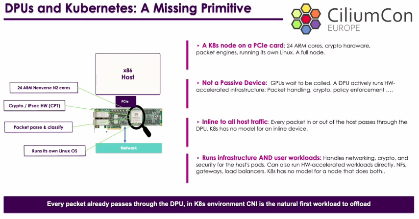
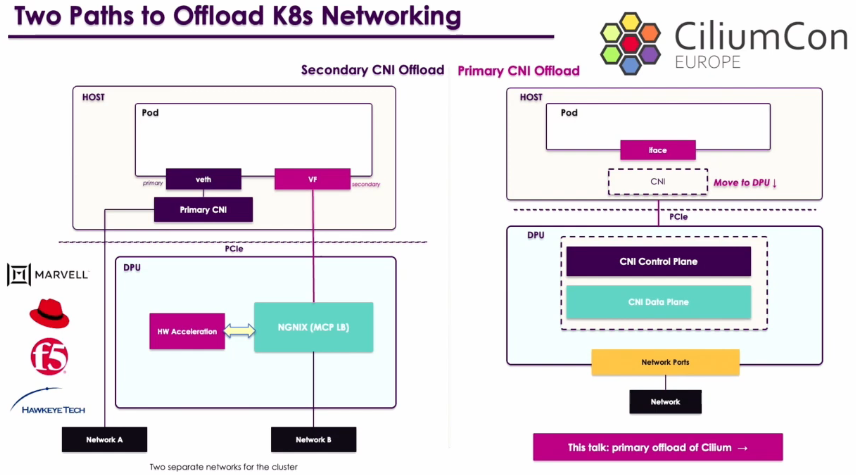
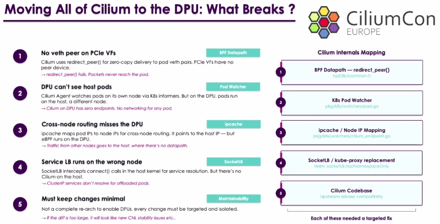
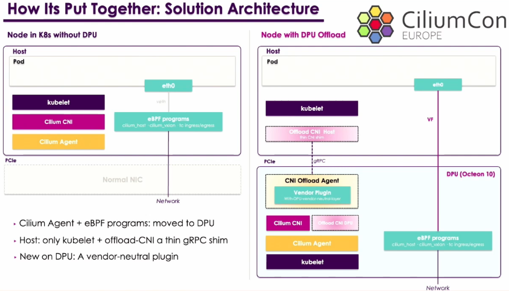
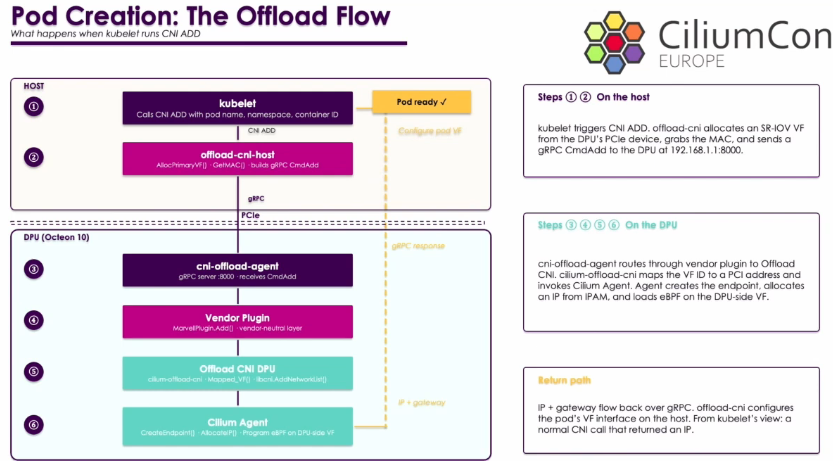
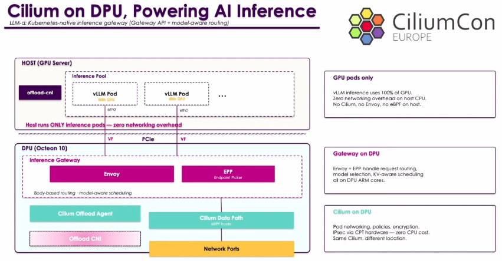

### 0. CiliumCon 2026
- [Youtube](https://www.youtube.com/watch?v=Bf7B3o8vkdg&list=PLj6h78yzYM2Mqbd68w9kzYHQ8D7ygqstS&index=2&t=1s)

# Accelerating Cilium - Our Journey on Offloading Cilium To DPU
- Cilium을 DPU로 오프로딩 한 과정
- 쿠버네티스 워크로드를 DPU로 오프로드하는 방안 검토
- 하지만 쿠버네티스는 DPU와 호환성이 좋지 않다.

## 01. DPU on Kubernetes

- DPU : NIC에 내장된 독립적인 칩을 말한다. (CPU와 자체 OS를 포함하고 있다.)
- DPU 는 수동적인 GPU와 달리 독립된 또 다른 노드와 같다.
- 자체 OS를 실행하고 있다.
- 현재, DPU를 쿠버네티스 클러스터에서 사용하기 위해 설계/개발된 컴포넌트는 별도로 없다.
- 쿠버네티스 워크로드를 DPU로 오프로딩 한다는 것은 CNI를 오프로딩하는 것과 같은 의미이다.

## 02. CNI를 오프로딩하는 2가지 방법

1. Secondary CNI Offload
	1. 현재 오프로딩 시 대중적으로 많이 사용하는 방법
	2. 기존 K8s 네트워크는 그대로 두고, seconday 네트워크 인터페이스를 파드에 할당하고, 이를 VF를 사용해 DPU로 오프로딩하는 방식
		1. 고성능 저지연 인터페이스 사용 가능
2. ==Primary CNI Offload==
	1. 주 CNI를 오프로딩하는데도 여러 방법이 있다.
	2. CNI 전체를 데이터플레인으로 옮기는 방향 검토.
		1. Secondary CNI 오프로딩 방식은, 오프로딩한 네트워크 인터페이스는 CNI에서 관리가 안되기 때문에, Visibility Observability 등을 별도의 방법으로 확보해야 한다.
		2. 하지만 주 CNI 오프로딩은 기존 CNI의 풍부한 기능들을 그대로 사용할 수 있다.

## 03. Cilium의 모든 것을 DPU로 옮기기

## 04. 솔루션 아키텍처

## 05. 파드 생성 흐름

1. kubelet 이 오프로딩 CNI를 호출
	1. 오프로딩 CNI가 직접 veth를 생성하고 파드에 추가하지 않는다.
2. 오프로딩 CNI는 SR-IOV의 VF 풀에서 VF 포트 하나를 선택한다.
3. 선택한 VF 포트(ID)를 파드에 할당하고, 해당 정보를 DPU에 공유한다.
4. 전달 받은 VF 포트 정보 전달 받은 DPU 상의 Agent가 이를 확인하고, 벤더 플러그인을 사용한다.
5. 벤더 플로그인은 전달 받은 VF 포트 정보를 기반으로 실제 PCI 주소 및 net device 이름을 반환하여, 오프로딩 CNI로 전달한다.
6. Cilium은 기존의 veth로 수행하던 Pod IP 할당 과정으로 vf 인터페이스를 대상으로 하여 동일하게 수행하여 kubelet으로 반환한다.
7. Pod가 정상 생성.

## 06. DPU 상 DataPath 흐름

- 파드에서 외부 트래픽 흐름
	- 호스트의 Pod는 `eth0`(VF)로 패킷을 보내고, PCIe를 통해 DPU의 `sdp_vf` 인터페이스로 도달.
	- TC hook에서 Cilium의 `from_container` eBPF 프로그램이 실행된다.
	- 이후 `route` → `eth0` → 네트워크로 송출
- 외부에서 파드로 트래픽 흐름
	- 외부에서 들어오는 트래픽은 `cilium_host` 또는 `cilium_vxlan` 인터페이스에서 각각 `from_host` / `from_overlay` eBPF 프로그램이 처리한다.
	- from_overlay(VXLAN)
		- 기존 VXLAN 캡슐화/역캡슐화 로직이 그대로 동작.
	- ipcache가 호스트 IP 대신 **DPU IP를 반환**하도록 nodeIP override. `cni.offload` 레이블을 체크해서 DPU 환경임을 식별 (`pkg/k8s/watchers/cilium_endpoint.go`)

## 07. DPU 오프로딩으로 얻는 이점 (AI Inference)

- 핵심
	- GPU 서버의 CPU는 AI 워크로드에서 Inference(추론)만 담당하고, 네트워크는 DPU가 담당한다.
- ### HOST (GPU Server)
	- 호스트에는 vLLM 추론 Pod만 존재합니다
	- Cilium, Envoy, eBPF 등 네트워킹 컴포넌트가 호스트에 전혀 없다.
	- vLLM은 GPU를 100% 사용하고, 호스트 CPU에 네트워킹 오버헤드가 전혀 발생하지 않는다.
	- Pod의 네트워크 인터페이스는 SR-IOV VF이며, PCIe를 통해 DPU와 연결된다.
- ### DPU
	- #### 1) Inference Gateway
		- Envoy
			- HTTP/gRPC 요청을 받아 body 기반 라우팅을 수행합니다. 어떤 모델에 대한 요청인지 파악해 적절한 vLLM Pod로 전달한다
		- EPP (Endpoint Picker)
			- KV 캐시 상태를 인식하는 스케줄러입니다. 어떤 vLLM Pod가 해당 요청의 KV 캐시를 이미 갖고 있는지 파악해 최적의 Pod를 선택한다 (KV-aware scheduling)
		- 이 모든 처리가 **DPU의 ARM 코어**에서 실행되므로 GPU 서버 CPU 개입이 없다.
	- #### 2) Cilium Data Path
		- Pod 네트워킹, 네트워크 정책, IPsec 암호화(CPT HW)를 모두 DPU에서 처리된다
		- 호스트 관점에서는 "일반적인 CNI 호출을 했더니 IP가 돌아온" 것으로만 보인다