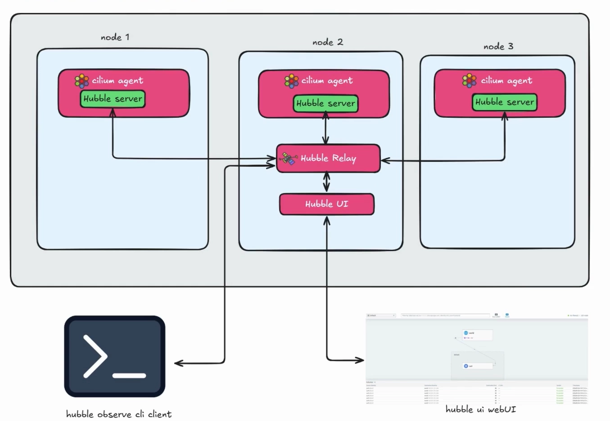
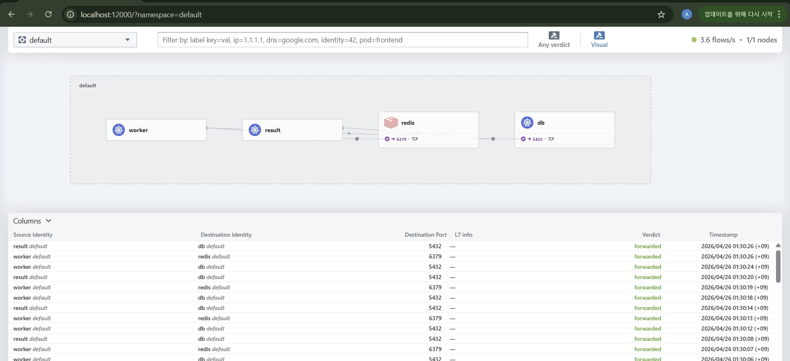
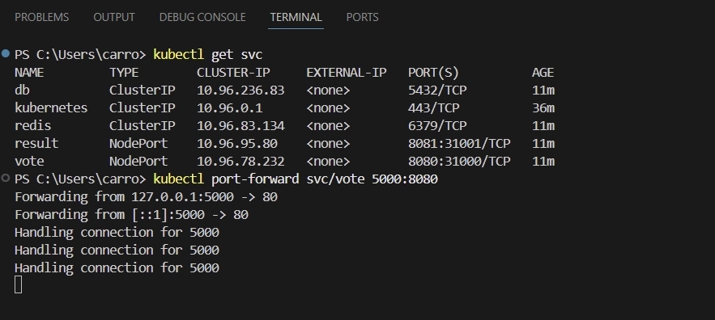
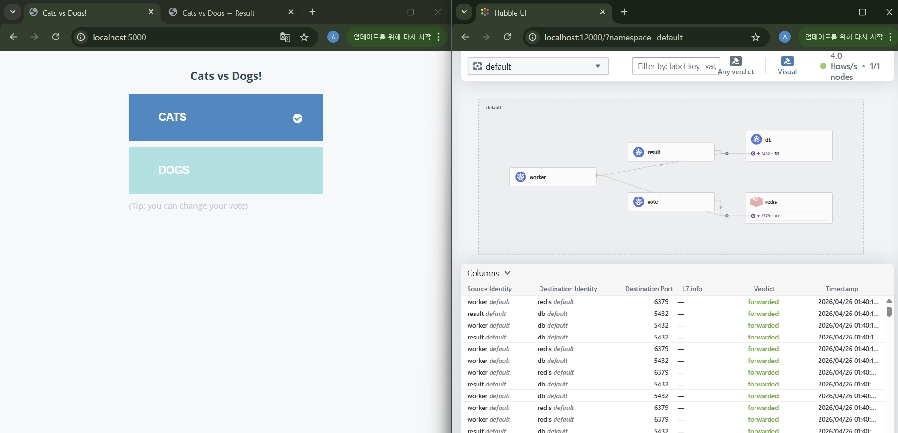
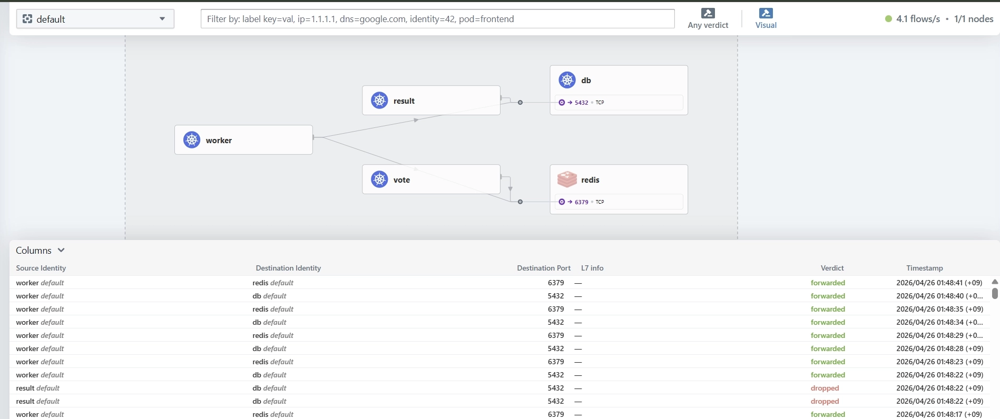

실리움(Cilium)은 클러스터 전체의 네트워크를 관리하며, 그 위에 **Hubble**이라는 강력한 가시성 도구를 제공합니다.

- **Hubble Agent:** 모든 노드에 DaemonSet으로 실행되며, 각 노드의 트래픽을 수집합니다.
- **Hubble Relay:** 각 노드에 흩어진 데이터를 gRPC 통신으로 취합하는 **중앙 허브** 역할을 합니다.
- **인터페이스:** 사용자는 취합된 데이터를 **Hubble CLI**(텍스트 로그) 또는 **Hubble UI**(그래프 시각화)를 통해 확인할 수 있다.

---

## 환경 구축 요약 (Local 환경: kind)

로컬 환경에서 쿠버네티스 클러스터를 생성하고 Cilium 인프라를 구축한 과정입니다.

1. **클러스터 생성:** `kind`를 사용하여 로컬에 쿠버네티스 노드(`cilium-stud`) 생성.
2. **Cilium CLI 설치:** 윈도우용 `cilium.exe` 설치 및 환경 변수 확인.
3. **Cilium & Hubble 설치:**
    - `cilium install`: 클러스터에 Cilium 에이전트 배포.
    - `cilium hubble enable --ui`: 데이터 취합을 위한 Relay와 시각화 대시보드(UI) 활성화.

---

## 실습용 애플리케이션: Voting App

**고양이 vs 강아지 투표 앱**을 배포했습니다.

- **구조:** `vote` (프론트엔드) → `redis` (큐) → `worker` (백엔드) → `db` (PostgreSQL) ← `result` (결과창)

  

- **접속 설정:** `kubectl port-forward`를 통해 로컬 환경(`localhost:5000`, `5001`)과 클러스터 내부 서비스를 연결.

  

---

## 실습 01: 네트워크 가시성 (Observability)

- **관찰 결과:** 투표 버튼 클릭 시 `vote` → `redis` → `worker` → `db`로 이어지는 데이터 파이프라인이 실시간 화살표로 시각화됨.



- **장점:** 컨테이너마다 일일이 들어가 로그를 뒤지지 않아도 전체 시스템의 흐름을 한눈에 파악 가능.
- **초기 상태:** 모든 통신이 허용되어 로그에 **`forwarded`** (초록색) 판정이 찍힘.

## 실습 02: L3/L4 네트워크 정책 (Security)

특정 서비스 간의 통신을 차단하는 **제로 트러스트(Zero Trust)** 보안 정책을 적용했습니다.

### 보안 정책 설정 (`secure-db.yaml`)

`db` 파드에 대해 `worker` 파드만 접근을 허용하고, 결과창인 `result` 파드의 접근은 차단하도록 설정했습니다.

PS C:\Users\carro> notepad secure-db.yaml

```python
apiVersion: "cilium.io/v2"
kind: CiliumNetworkPolicy
metadata:
  name: "secure-db"
spec:
  endpointSelector:
    matchLabels:
      app: db
  ingress:
  - fromEndpoints:
    - matchLabels:
        app: worker
    toPorts:
    - ports:
      - port: "5432"
        protocol: TCP
```

PS C:\Users\carro> kubectl apply -f secure-db.yaml

### 결과 확인



- **Hubble UI:** `result` → `db` 경로의 화살표가 **빨간색**으로 변하며 차단됨을 시각적으로 확인.
- **패킷 로그:** 로그 상에 실시간으로 **`dropped`** (빨간색) 판정이 찍히며 보안 정책이 즉시 반영됨을 검증.
- **애플리케이션:** 결과창 페이지(`localhost:5001`)가 DB 데이터를 불러오지 못해 먹통이 됨.