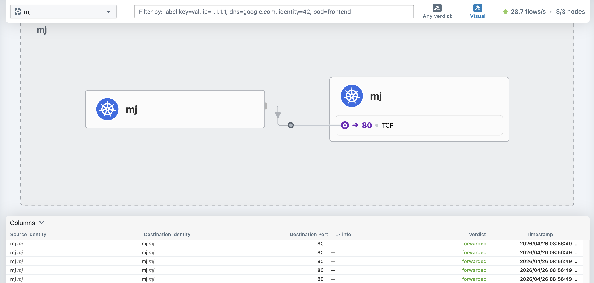
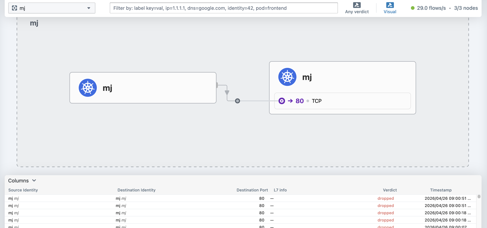

# Hubble 분석

## 1. Hubble 이란?
Cilium 위에서 동작하는 네트워크 관찰성 플랫폼으로, K8s 클러스터 내부에서 어떤 트래픽이 어디서 어디로 흐르는지 실시간으로 볼 수 있음


## 2. Flow Visibility

Pod 간 트래픽 흐름을 실시간으로 관찰해서 누가 누구에게 어떤 프로토콜로 통신하는지 확인

1. **상세한 패킷 정보**
   단순히 IP 대 IP 통신을 넘어 어떤 파드에서 어떤 파드로 통신이 가는지, 네임스페이스와 레이블 정보를 포함한 아이덴티티 기반 정보를 제공

2. **프로토콜 가시성**
   TCP/UDP(L4)뿐만 아니라 HTTP, gRPC, Kafka 등 애플리케이션 계층 프로토콜의 상세 호출 흐름까지 파악 가능

3. **Hubble UI**
   텍스트 로그가 아닌 그래픽 맵을 통해 트래픽 흐름을 시각적으로 보여줌. 어떤 노드에서 병목이 생기는지 비정상적인 트래픽이 어디로 흐르는지 직관적으로 알 수 있음


## 3. L3/L4 Policy (정책 가시성 및 검증)

1. **Policy Verdict (정책 판정)**
   특정 트래픽이 왜 차단되었는지 혹은 허용되었는지 실시간으로 확인 가능

2. **L3/L4 제어**
   IP 및 포트 기반의 전통적인 방화벽 규칙이 제대로 작동하는지 모니터링

3. **L7 정책 심층 분석**
   단순히 포트가 열려 있는지 확인하는 것을 넘어 특정 HTTP 경로(`/api/v1/admin`)에 대한 접근 정책이 올바르게 차단되고 있는지 모니터링


## 4. Observability (관측 가능성)

1. **시그널 제공**
   서비스 간 통신 시 지연 시간, 에러율, 처리량을 수집

2. **Prometheus & Grafana 연동**
   수집된 메트릭을 Prometheus에 저장하고 Grafana 대시보드로 시각화하여 시간에 따른 네트워크 변화 추이를 분석 가능

   - 특정 서비스의 HTTP 응답 코드가 `5xx`인 트래픽만 필터링
   - 특정 API 호출의 P99 응답 속도가 느려진 원인 파악


## 왜 Hubble 인가?

Hubble은 eBPF를 이용해 커널 레벨에서 데이터를 수집하므로 애플리케이션에 성능 부하를 거의 주지 않으면서도 네트워크 정책부터 성능 지표까지 한눈에 파악할 수 있음


# Hubble Observability 실습

## 환경 구성

### Hubble Relay 연결
```bash
root@control-plane:~# kubectl port-forward -n kube-system svc/hubble-relay 4245:80 &
[1] 1282502
root@control-plane:~# Forwarding from 127.0.0.1:4245 -> 4245
Forwarding from [::1]:4245 -> 4245
Handling connection for 4245
```

```bash
root@control-plane:~# hubble status
Healthcheck (via localhost:4245): Ok
Current/Max Flows: 9,255/12,285 (75.34%)
Flows/s: 28.43
Connected Nodes: 3/3
```

### Hubble UI 접속
```bash
# 서버에서 port-forward
kubectl port-forward -n kube-system svc/hubble-ui 12000:80 &

# 로컬 PC에서 SSH 터널링
ssh -L 12000:localhost:12000 root@<control-plane IP>

# 브라우저 접속
http://localhost:12000
```

---

## 실습 1 — FORWARDED 트래픽 확인

### Pod 생성
```bash
# server pod (nginx)
kubectl run server --image=nginx --namespace=mj

# client pod (curl)
kubectl run client --image=curlimages/curl --namespace=mj -- /bin/sh -c "sleep infinity"

# 확인
kubectl get pods -n mj -o wide
```

### 트래픽 발생
```bash
# client에서 server로 반복 요청
kubectl exec -n mj client -- /bin/sh -c "
  while true; do
    curl -s http://<server-IP>/
    sleep 1
  done
"
```

### Flow 확인
```bash
root@control-plane:~# hubble observe --namespace mj -f
Apr 25 23:56:58.757: mj/client:50... (ID:41..) -> mj/server:80 (ID:13...) to-endpoint FORWARDED (TCP Flags: SYN)
Apr 25 23:56:58.757: mj/client:50... (ID:41..) <- mj/server:80 (ID:13...) to-endpoint FORWARDED (TCP Flags: SYN, ACK)
```


> **Hubble UI**: 네임스페이스를 `mj`로 선택하면 client → server 초록색 화살표 확인 가능



---

## 실습 2 — DROPPED 트래픽 확인 (NetworkPolicy)

### deny-all 정책 적용
```yaml
# deny-all.yaml
apiVersion: networking.k8s.io/v1
kind: NetworkPolicy
metadata:
  name: deny-all
  namespace: mj
spec:
  podSelector: {}
  policyTypes:
  - Ingress
  - Egress
```

```bash
kubectl apply -f deny-all.yaml
```

### 트래픽 차단 확인
```bash
# curl 시도 → 타임아웃 발생 (exit code 28)
kubectl exec -n mj client -- curl -s --max-time 3 http://<server-IP>/
```

### DROPPED Flow 확인
```bash
hubble observe --namespace mj --verdict DROPPED -f
```

> **Hubble UI**: client → server 빨간색 화살표로 변경됨


